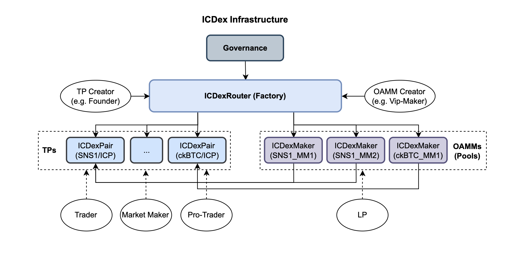

# ICDex

## Instruction

ICDex is an order book DEX built on the IC network and supports the token standards ICRC1 and DRC20.  
ICDex can be deployed on the IC main network or on a local test network. Due to ICDex's dependency on the DRC205 instance (canister-id: lw5dr-uiaaa-aaaak-ae2za-cai) and the ICLighthouse NFT (canister-id: goncb-kqaaa-aaaap-aakpa-cai) on the IC main network, locally deployed instances will not synchronize transaction records to the DRC205 instance (they will be cached locally) and will not be able to use features that require ICLighthouse NFTs as qualification (you can deploy a collection of NFTs locally). These features are non-core and have a low impact on testing.

OrderBook: https://github.com/iclighthouse/ICDex/blob/main/OrderBook.md

ICDex Infrastructure:




## Dependent toolkits

### dfx
- https://github.com/dfinity/sdk/
- version: 0.15.3 (https://github.com/dfinity/sdk/releases/tag/0.15.3)
- moc version: 0.10.3

### vessel
- https://github.com/dfinity/vessel
- version: 0.7.0 (https://github.com/dfinity/vessel/releases/tag/v0.7.0)

### ic-wasm
- https://github.com/dfinity/ic-wasm
- version: 0.7.0 (https://github.com/dfinity/ic-wasm/releases/tag/0.7.0)

### ic-repl
- https://github.com/dfinity/ic-repl/
- version: 0.6.2 (https://github.com/dfinity/ic-repl/releases/tag/0.6.2)
- Install to the directory `/usr/local/bin/ic-repl`

## Tokens for testing

### 1. ICLtest
```
dfx canister --network ic create ICLtest --controller __your principal__
dfx build --network ic ICLtest
dfx canister --network ic install ICLtest --argument '(record { totalSupply=100000000000000000; decimals=8; fee=1000000; name=opt "ICLtest"; symbol=opt "ICLtest"; metadata=null; founder=null;}, true)'
```

### 2. Token0
```
dfx canister --network ic create Token0 --controller __your principal__
dfx build --network ic Token0
dfx canister --network ic install Token0 --argument '(record { totalSupply=100000000000000000; decimals=8; fee=10000; name=opt "Token0"; symbol=opt "Token0"; metadata=null; founder=null;}, true)'
```

### 3. Token1
```
dfx canister --network ic create Token1 --controller __your principal__
dfx build --network ic Token1
dfx canister --network ic install Token1 --argument '(record { totalSupply=100000000000000000; decimals=8; fee=10000; name=opt "Token1"; symbol=opt "Token1"; metadata=null; founder=null;}, true)'
```

## Compiles

### 1. ICDexRouter
```
dfx canister --network ic create ICDexRouter --controller __your principal__
dfx build --network ic ICDexRouter
cp -f .dfx/ic/canisters/ICDexRouter/ICDexRouter.wasm wasms/
```
- Code: "src/ICDexRouter.mo"
- Module hash: 15e03d8f87b30e26f660f3790c0100bd950a3bd4d4aba0274320bde85b19c1f8
- Version: 0.12.26
- Build: {
    "args": "--compacting-gc"
}

### 2. ICDexPair
```
dfx canister --network ic create ICDexPair --controller __your principal__
dfx build --network ic ICDexPair
cp -f .dfx/ic/canisters/ICDexPair/ICDexPair.wasm wasms/
```
- Replace the compressed candid with ic-wasm.
```
ic-wasm wasms/ICDexPair.wasm -o wasms/ICDexPair.wasm metadata candid:service -f wasms/Pair.did -v public
```
- Code: "src/ICDexPair.mo"
- Module hash: b51504697238c12facd4d6e4f8c9a4aa677653231e953499cf1ef06acfb7b18d
- Version: 0.12.48
- Build: {
    "args": "--incremental-gc"
}

### 3. ICDexMaker
```
dfx canister --network ic create ICDexMaker --controller __your principal__
dfx build --network ic ICDexMaker
cp -f .dfx/ic/canisters/ICDexMaker/ICDexMaker.wasm wasms/
```
- Code: "src/ICDexMaker.mo"
- Module hash: 66eb5eab4513cacc85288924f25d860ca7ce46918a456663433b806ddd694ae3
- Version: 0.5.6
- Build: {
    "args": "--compacting-gc", 
    "optimize": "size"
}

## Deployment of ICDex

### 1. Deploy ICDexRouter
```
dfx canister --network ic install ICDexRouter --argument '(principal "__dao-canister-id or your-principal__", true)'
```
- args:
    - initDAO: Principal.  // Owner (DAO) principal. You can fill in your own Principal when testing.
    - isDebug: Bool

### 2. (optional) Config ICDexRouter
- call ICDexRouter.sys_config()
```
dfx canister --network ic call ICDexRouter sys_config '(record{ sysToken = opt principal "__ICLtest-canistter-id__"; sysTokenFee = opt 1000000 })'
```
- args: 
```
{
    aggregator: ?Principal; // External trading pair aggregator. If not configured, it will not affect use.
    blackhole: ?Principal; // Black hole canister, which can be used as a controller for canisters to monitor their cycles and memory.
    icDao: ?Principal; // The canister that governs ICDex is assigned the value initDAO at installation. a private principal can be filled in at test time.
    nftPlanetCards: ?Principal; // ICLighthouse NFT.
    sysToken: ?Principal; // ICDex governance token canister-id.
    sysTokenFee: ?Nat; // smallest units. Transfer fee for ICDex governance token.
    creatingPairFee: ?Nat; // smallest units. The fee to be paid for creating a trading pair by pubCreate().
    creatingMakerFee: ?Nat; // smallest units. The fee to be paid for creating an automated market maker pool canister.
}
```

### 3. Set ICDexPair wasm
- call ICDexRouter.setICDexPairWasm()
```
dfx canister --network ic call ICDexRouter setICDexPairWasm '(__ICDexPair.wasm bytes([nat8])__, "__ICDexPair version__", null)'
```
Or use ic-repl (/usr/local/bin/ic-repl)  
Note: Local network using setPairWasm_local.sh
```
export IdentityName=default
export ICDexRouterCanisterId=__ICDexRouter-canister-id__
export ICDexPairVersion=__ICDexPair-version__
chmod +x  wasms/setPairWasm.sh
wasms/setPairWasm.sh
```

### 4. Create trading pair
- call ICDexRouter.create()
```
dfx canister --network ic call ICDexRouter create '(principal "__Token0-canister-id__", principal "__Token1-canister-id__", __opning-time-nanoseconds__, null, null)'
```
- args:
    - token0: Principal // base token canister-id
    - token1: Principal // quote token canister-id
    - openingTimeNS: Time.Time // Set the time in nanoseconds when the pair is open for trading. If an IDO needs to be started, it is recommended that at least 4 days be set aside.
    - unitSize: ?Nat64 // (optional) UNIT_SIZE: It is the base number of quotes in the trading pair and the minimum quantity to be used when placing an order. The quantity of the order placed must be an integer multiple of UNIT_SIZE. E.g., 1000000
    - initCycles: ?Nat // (optional) The amount of cycles added for the newly created trading pair.
- returns:
    - res: Principal // Trading pair cansiter-id

### 5. trade
- call ICDexPair.trade()
```
dfx canister --network ic call __ICDexPair-canister-id__ trade '(record{ quantity = variant{Buy = record{500_000_000: nat; 500_000_000: nat} }; price = 10_000_000: nat }, variant{ LMT }, null, null, null, null)'
dfx canister --network ic call __ICDexPair-canister-id__ trade '(record{ quantity = variant{Sell = 100_000_000: nat }; price = 10_000_000: nat }, variant{ LMT }, null, null, null, null)'
```
args: see `docs/ICDexPair.md` documentation.

### 6. (optional) Set ICDexMaker wasm
- call ICDexRouter.setICDexMakerWasm()
```
dfx canister --network ic call ICDexRouter setICDexMakerWasm '(__ICDexMaker.wasm bytes([nat8])__, "__ICDexMaker version__", null)'
```
Or use ic-repl (/usr/local/bin/ic-repl)  
Note: Local network using setMakerWasm_local.sh
```
export IdentityName=default
export ICDexRouterCanisterId=__ICDexRouter-canister-id__
export ICDexMakerVersion=__ICDexMaker-version__
chmod +x  wasms/setMakerWasm.sh
wasms/setMakerWasm.sh
```

### 7. (optional) Create ICDexMaker (OAMM) for trading pair

#### Step 1. call maker_create() 
Note: Requires the trading pair to complete at least one trade.
- call ICDexRouter.maker_create()
```
dfx canister --network ic call ICDexRouter maker_create '(record{ pair = principal "__ICDexPair-canister-id__"; allow = variant{Public}; name = "MakerTest1"; lowerLimit = 1; upperLimit = 10_000_000_000_000; spreadRate = 10_000; threshold = 1_000_000_000_000; volFactor = 2; creator = null })'
```
- args: 
```
{
    pair: Principal; // Trading pair caniser-id.
    allow: {#Public; #Private}; // Visibility. #Public / #Private.
    name: Text; // Name. e.g. "AAA_BBB AMM-1"
    lowerLimit: Nat; // Lower price limit. How much token1 (smallest units) are needed to purchase UNIT_SIZE token0 (smallest units).
    upperLimit: Nat; // Upper price limit. How much token1 (smallest units) are needed to purchase UNIT_SIZE token0 (smallest units).
    spreadRate: Nat; // ppm. Inter-grid spread ratio for grid orders. e.g. 10_000, it means 1%. It will create 2 grid strategies, the second strategy has a spreadRate that is 5 times this value.
    threshold: Nat; // token1 (smallest units). e.g. 1_000_000_000_000. After the total liquidity exceeds this threshold, the LP adds liquidity up to a limit of volFactor times his trading volume.
    volFactor: Nat; // LP liquidity limit = LP's trading volume * volFactor.  e.g. 2
    creator: ?AccountId; // Specify the creator.
}
```
- returns:
    - res: Principal // ICDexMaker cansiter-id

#### Step 2. Make ICDexMaker get the vip-maker role to create/update a grid order for free. 
- call ICDexRouter.pair_setVipMaker()
```
dfx canister --network ic call ICDexRouter pair_setVipMaker '(principal "__ICDexPair-canister-id__", "__ICDexMaker-canister-id__", 90)'
```

#### Step 3. The creator activates ICDexMaker by adding the first liquidity
The creator activates ICDexMaker by adding the first liquidity.
The first liquidity must be added by the creator, requiring the amount of token0 to be greater than token0_fee * 100000, and the amount of token1 to be greater than token1_fee * 100000.

- call ICDexMaker.add()
```
dfx canister --network ic call __ICDexMaker-canister-id__ add '(10_000_000_000: nat, 10_000_000_000: nat, null)'
```

## Docs

https://github.com/iclighthouse/ICDex/tree/main/docs

## Implementation

### ICDex UI
- ICLight: https://iclight.io
- For security reasons, it is recommended to deploy your own front-end or access it via APIs.

### DEX Explorer
- ICHouse: https://ic.house/swaps

### Canisters

- ICDexRouter (Testnet)
    - Canister-id: pymhy-xyaaa-aaaak-act7a-cai

## Disclaimer

The project may have undiscovered defects, and you may face technical risks, counterparty risks, legal risks, hacker attacks and many other risks in using it, you need to fully understand the project before using it, and bear all the risks of using it by yourself.

ICLighthouse is a community-driven decentralised project, which is considered a community collaboration dedicated to developing infrastructure on IC. ICLighthouse is provided “as is”, and utilized at your own risk and responsibility without any guarantee. ICLighthouse token ICL is only used for governance and utility, and no team or individual guarantees its value. Therefore, before utilizing this service you should review its documentation and codes carefully to fully understand its functioning and the risks that could entail the usage of a service built on open protocols on an autonomous blockchain network (the Internet Computer). No individual, entity, developer (internal to the founding team, or from the ICLighthouse community), or ICLighthouse itself will be considered liable for any damages or claims related to the usage, interaction, or lack of functioning associated with the ICLighthouse, its interfaces, or websites. This includes loss of profits, assets of any value, or indirect, incidental, direct, special, exemplary, punitive or consequential damages. The same applies to the usage of ICLighthouse through third-party interfaces or applications that integrate/surface it. It is your responsibility to manage the risk of your activities and usage on said platforms/protocols. Utilizing this project/protocol may not comply with the requirements of certain regional laws. You are requested to comply with local laws and to assume all legal consequences arising from its use.
